# Exercicios simples em Python
> Exercicios feito em aula para introdução a programação e python

|       Enunciado                  |            Exercicio resumido                    |               Respostas                                      |       
|----------------------------------|--------------------------------------------------|--------------------------------------------------------------|
|      [Exercicio 1](#ancora1)     |   Exercicio em python : 10 numero pares                 |[Resolução](exercicios/10_n_pares.py)                  |   
|      [Exercicio 2](#ancora2)     |   Exercicio em python : Aluno aprovado e reprovado      |[Resolução](exercicios/aluno_aprovado_reprovado.py)    |   
|      [Exercicio 3](#ancora3)     |   Exercicio em python : Calculo básico                  |[Resolução](exercicios/conta.py)                       |     
|      [Exercicio 4](#ancora4)     |   Exercicio em python : Código valido e inválido        |[Resolução](exercicios/codigo_valido_invalido.PY)      |   
|      [Exercicio 5](#ancora5)     |   Exercicio em python : Comissão vendedor               |[Resolução](exercicios/comiso_vendedor.py)             |   
|      [Exercicio 6](#ancora6)     |   Exercicio em python : Diferença entre números         |[Resolução](exercicios/diferena_entre_num.py)          |   
|      [Exercicio 7](#ancora7)     |   Exercicio em python : Dobro de um numero              |[Resolução](exercicios/dobro_num.py)                   |   
|      [Exercicio 8](#ancora8)     |   Exercicio em python : Converter dólar em real         |[Resolução](exercicios/dolar_em_reais.py)              |   
|      [Exercicio 9](#ancora9)     |   Exercicio em python : Remover e adicionar em lista    |[Resolução](exercicios/lista_adicionar_remover.py)     | 
|      [Exercicio 10](#ancora10)   |   Exercicio em python : Notas de aluno semestre         |[Resolução](exercicios/notas_prova.py)                 |   
|      [Exercicio 11](#ancora11)   |   Exercicio em python : Modulo de um número             |[Resolução](exercicios/num_módulo.py)                  |   
|      [Exercicio 12](#ancora12)   |   Exercicio em python : Impar ou par                    |[Resolução](exercicios/num_par_ou_impar.py)            |  
|      [Exercicio 13](#ancora13)   |   Exercicio em python : Positivo ou Negativo            |[Resolução](exercicios/num_positivo_negativo.py)      | 
 
  
# [Exercicio 1](#ancora)
 imprimir os 10 primeiros números pares a partir de 1
 
## Executando
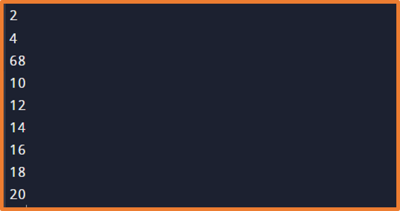

# [Exercicio 2](#ancora)
Receber a entrada de nome, nota1, nota2 e calcular a média do aluno aprovado ou reprovado com nota menor igual a sete.
 
## Executando
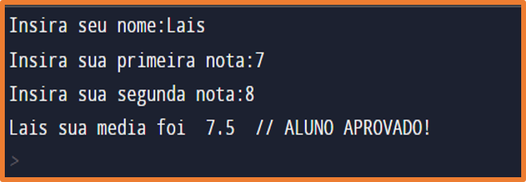

# [Exercicio 3](#ancora)
Receber a entrada de dois valores, em seguida mostrar a opção de cálculo de adição, subtração, multiplicação e divisão e calcular de acordo com a opção desejada do usuário
 
## Executando
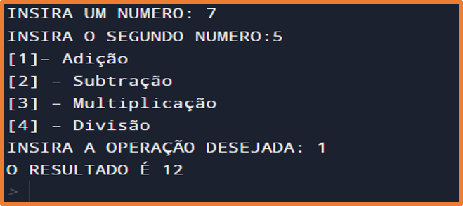

# [Exercicio 4](#ancora)
Receber a entrada de um código se ele for igual a 1 ,2 ou 3 apresentar a mensagem de código valido caso ao contrário código inválido
 
## Executando
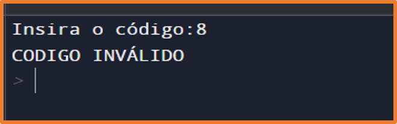

# [Exercicio 5](#ancora)
Receber a entrada de nome do vendedor, código da peça, valor e quantidade vendida e retornar a comissão de 5% do vendedor
 
## Executando
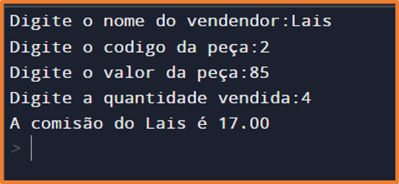

# [Exercicio 6](#ancora)
Receber a entrada de dois valores e calcular a diferença entre eles
 
## Executando
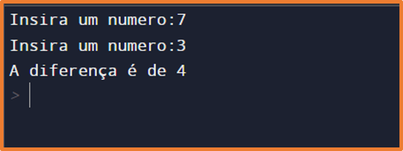

# [Exercicio 7](#ancora)
Receber a entrada de um valor e retornar o dobro dele 
 
## Executando
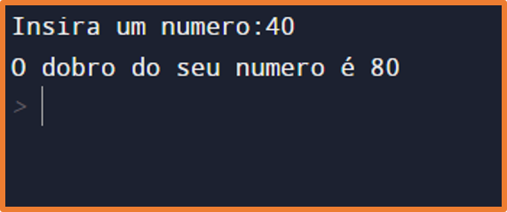

# [Exercicio 8](#ancora)
Receber a entrada do valor da cotação, o valor a ser convertido e apresentar a conversão
 
## Executando
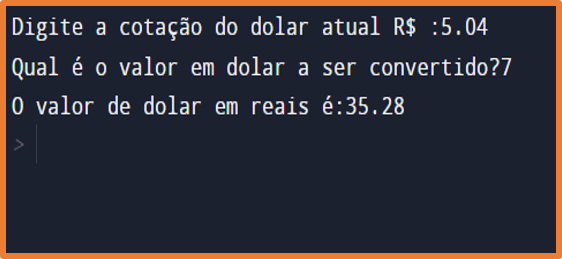

# [Exercicio 9](#ancora)
Mostrar uma lista e permitir remover e adicionar, em seguida apresentar a lista atualizada
 
## Executando
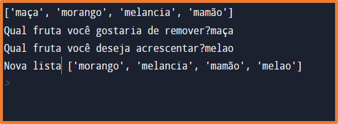

# [Exercicio 10](#ancora)
Receber a entrada de nome do aluno, sua nota na prova1 e prova2, fazer a média. 
Retorna se o aluno está de exame ou não, caso sim permitir inserir a nota do exame 
e em seguida mostrar se foi aprovado ou ficou de DP.
 
## Executando
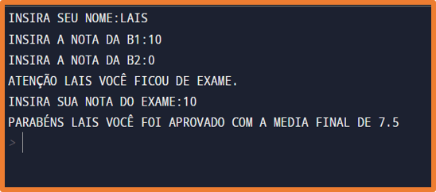

# [Exercicio 11](#ancora)
Receber a entrada de um valor e calcular seu módulo
 
## Executando
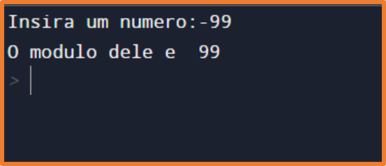

# [Exercicio 12](#ancora)
Receber a entrada de um numero e retornar se é par ou impar
 
## Executando
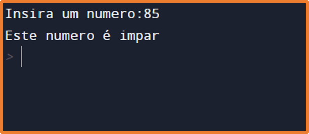

# [Exercicio 13](#ancora)
Receber a entrada de um numero e retornar se é positivo ou negativo            
 
## Executando
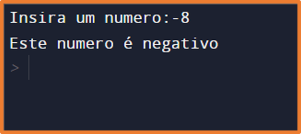
